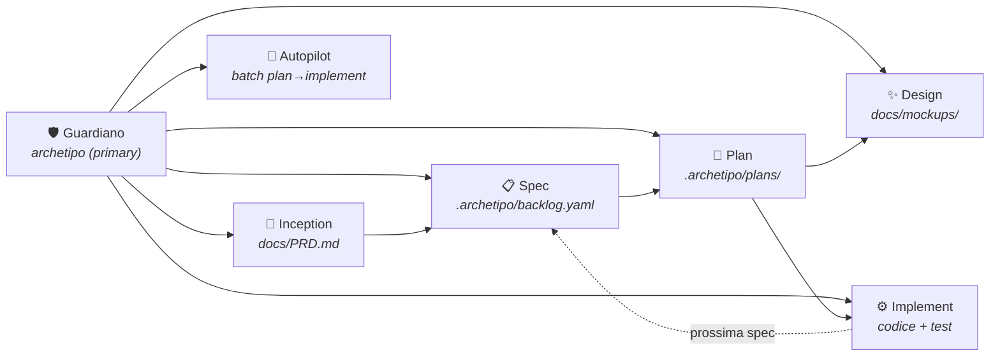

# ARchetipo su OpenCode

Benvenuto. Questa guida spiega come usare ARchetipo dentro **OpenCode CLI** con il massimo delle sue potenzialità: agenti specializzati, permessi granulari e un workflow spec-driven che non lascia artefatti sparsi.

---

## Architettura agenti

Quando inizializzi un progetto con `--tool opencode`, ARchetipo installa **7 agenti** in `.opencode/agents/`:

| Agente | `mode` | Cosa fa | Permessi edit |
|---|---|---|---|
| `archetipo` | **primary** | Guardiano del workflow: blocca operazioni invalide e dispaccia il lavoro ai subagenti giusti | `.archetipo/*` |
| `archetipo-inception` | subagent | Product discovery: scrive il PRD | `.archetipo/*`, `docs/*` |
| `archetipo-spec` | subagent | Crea backlog e spec da PRD | `.archetipo/*` |
| `archetipo-plan` | subagent | Pianificazione tecnica di una spec | `.archetipo/*` |
| `archetipo-design` | subagent | Mockup HTML/CSS isolati in `docs/mockups/` | `docs/mockups/**` **solo qui** |
| `archetipo-implement` | subagent | Codice, test e review | tutto tranne `.archetipo/*` |
| `archetipo-autopilot` | subagent | Orchestra plan→implement su più spec in batch | solo file di stato |

### I guardrail: permessi come vincoli di fase

Ogni agente ha permessi calibrabili al percorso. Non è un accidente: è il meccanismo che **impedisce a un agente di sconfinare** nella fase sbagliata.

| Agente | Può modificare | Non può modificare |
|---|---|---|
| `archetipo-design` | `docs/mockups/**` | source code, `.archetipo/*`, `docs/PRD.md` |
| `archetipo-implement` | source code, test, `docs/` | `.archetipo/*` (backlog, piani, PRD) |
| `archetipo-autopilot` | `.archetipo/autopilot-state-*` | source code, PRD, backlog, piani |
| `archetipo-inception` / `spec` / `plan` | `.archetipo/*` | source code |

Se un agente prova a scrivere fuori dalla sua zona, OpenCode **blocca l'operazione** con un errore chiaro. Non c'è rischio di danneggiare accidentalmente artefatti di un'altra fase.

---

## Installazione

### 1. Installa la CLI globalmente

```bash
npm install -g @techreloaded/archetipo
```

### 2. Inizializza un progetto per OpenCode

```bash
cd il-tuo-progetto
archetipo init --tool opencode --connector file
```

Il comando crea:

```
.il-tuo-progetto/
├── .opencode/
│   ├── agents/               # 7 agenti ARchetipo
│   │   ├── archetipo.md
│   │   ├── archetipo-inception.md
│   │   ├── archetipo-spec.md
│   │   ├── archetipo-plan.md
│   │   ├── archetipo-design.md
│   │   ├── archetipo-implement.md
│   │   └── archetipo-autopilot.md
│   └── skills/               # skill ARchetipo
│       ├── archetipo-inception/
│       ├── archetipo-spec/
│       ├── archetipo-plan/
│       ├── archetipo-design/
│       ├── archetipo-implement/
│       └── archetipo-autopilot/
├── .archetipo/
│   ├── config.yaml           # configurazione (connector, percorsi, stati)
│   └── shared-runtime.md     # regole condivise tra le skill
└── docs/
    └── (PRD.md, mockups/, ...)
```

### 3. Avvia OpenCode

```bash
opencode
```

ARchetipo si attiva automaticamente: l'agente `archetipo` (primary) esegue `archetipo spec list` e ti mostra lo stato del progetto.

---

## Workflow completo

Il ciclo di sviluppo con ARchetipo segue questi passi. Ogni passo è gestito da un agente diverso, con il Guardiano (`archetipo`) che fa da dispatcher.



### Esempio pratico

Ecco come si svolge una sessione tipica. I comandi che vedi sono ciò che scrivi tu in OpenCode; il resto lo gestiscono gli agenti.

#### 1. Inception — definisci il prodotto

```
Tu: Voglio creare un'app per il tracciamento delle abitudini quotidiane
```

Il Guardiano riconosce che non c'è un PRD e ti chiede se vuoi avviare la discovery. Alla tua conferma, spawna `archetipo-inception` che:
- fa domande su visione e target
- produce `docs/PRD.md` con vision, personas, MVP scope, requisiti funzionali

#### 2. Spec — crea il backlog

```
Tu: Crea il backlog dal PRD
```

Il Guardiano spawna `archetipo-spec` che legge il PRD e produce le user story in `.archetipo/backlog.yaml` e `.archetipo/specs/`.

```
Tu: Mostra lo stato del progetto
```

Il Guardiano risponde con:

```
Stato progetto: 5 spec TODO, 0 PLANNED, 0 IN PROGRESS, 0 REVIEW
```

#### 3. Plan — pianifica una spec

```
Tu: Pianifica la prima spec
```

Il Guardiano spawna `archetipo-plan` che produce `.archetipo/plans/US-001-plan.yaml` con:
- architettura della soluzione
- task ordinati
- strategia di test

Se serve un mockup UI, il plan agent spawna a sua volta `archetipo-design` che scrive in `docs/mockups/`.

#### 4. Implement — implementa una spec pianificata

```
Tu: Implementa US-001
```

Il Guardiano spawna `archetipo-implement` che:
1. Legge il piano
2. Imposta la spec in `IN PROGRESS`
3. Scrivi codice e test (wave di task)
4. Esegue code review
5. Porta la spec in `REVIEW`

L'agente implement **non può toccare** `.archetipo/*`: se prova a modificare backlog o piani, OpenCode lo blocca.

#### 5. Autopilot — batch processing

```
Tu: Esegui l'autopilot su tutte le spec TODO dell'epica "Core"
```

Il Guardiano spawna `archetipo-autopilot` che:
1. Filtra le spec per epic/priorità
2. Per ogni spec: spawna `archetipo-plan` → (se serve) `archetipo-design` → `archetipo-implement`
3. Aggiorna il file di stato `.archetipo/autopilot-state-*.md`
4. Riporta il riepilogo

---

## Comportamento del Guardiano

L'agente `archetipo` (primary) è il primo punto di contatto. Il suo compito è **proteggere il workflow**.

### Blocca se...

| Situazione | Blocco |
|---|---|
| Provi a implementare una spec `TODO` | "La spec US-001 è ancora TODO. Serve prima un piano." |
| Provi a scrivere codice senza una spec | Bloccato. Nessuna spec = nessun codice. |
| Provi a saltare la pianificazione | "Ogni spec deve essere pianificata prima di essere implementata." |
| Cambi scope a metà implementazione | "Questo cambio è una nuova spec. Creiamola e pianifichiamola." |

### Permette senza spec

Alcune attività non richiedono una spec attiva:
- Git (commit, push, branch, merge)
- Esecuzione test
- Esplorazione del codice
- Domande su architettura
- Lavoro su infrastruttura/tooling
- Creazione di un nuovo PRD o backlog

---

## Cosa succede quando un agente sconfina

Gli errori di permesso in OpenCode sono espliciti. Esempi reali:

```
# archetipo-design prova a modificare un file di codice
Error: agent "archetipo-design" does not have permission to edit "src/App.tsx"

# archetipo-implement prova a modificare il backlog
Error: agent "archetipo-implement" does not have permission to edit ".archetipo/backlog.yaml"

# archetipo-autopilot prova a leggere codice
Error: agent "archetipo-autopilot" does not have permission to read "src/main.go"
```

Non è un bug: è il **guardrail che funziona**. Se vedi un errore del genere, l'agente sta cercando di fare qualcosa fuori dal suo scopo. Il Guardiano principale può reindirizzare il lavoro all'agente giusto.

---

## Casi d'uso comuni

### Voglio solo esplorare il progetto

```
Tu: Come è strutturato il backend?
```

Il Guardiano spawna `explore` che legge i file e ti risponde. Nessuna spec necessaria.

### Voglio aggiungere una feature a un progetto esistente

```
Tu: Dobbiamo aggiungere l'autenticazione OAuth2
```

Il Guardiano: "Non trovo una spec per questa richiesta. Vuoi che crei un PRD e poi il backlog?"

```
Tu: Sì, procedi
```

Il Guardiano spawna `archetipo-inception` → `archetipo-spec`.

### Voglio correggere un bug

```
Tu: C'è un bug nella login page, l'ho fixato direttamente
```

Il Guardiano:
1. Non fa lezioni
2. Chiede se vuoi creare una spec retroattiva per documentare il fix
3. Se la spec esiste già e correggere rientra nell'implementazione corrente, lascia fare

---

## Note tecniche

- **La CLI `archetipo` deve essere nel PATH.** Le skill la invocano per ogni operazione di persistenza (leggere backlog, scrivere piano, etc.).
- **Il connector `file` è il default.** Funziona offline, tutto locale, tutto versionabile.
- **I 6 subagenti sono `hidden: true`.** Non appaiono nella lista agenti di OpenCode; sono invocabili solo via `task` dal primary agent.
- **Il primary agent `archetipo` ha `temperature: 0.1`.** È volutamente poco creativo: deve applicare le regole del workflow in modo deterministico.

---

## Risoluzione problemi

| Problema | Causa probabile | Soluzione |
|---|---|---|
| L'agente non si attiva all'avvio | `archetipo` CLI non trovata | `npm i -g @techreloaded/archetipo` |
| Errore "agent does not have permission" | L'agente sta sconfinando | Lascia fare: il guardrail protegge gli artefatti. Se serve davvero, chiedi al Guardiano di spawnare l'agente giusto |
| `archetipo spec list` fallisce | `.archetipo/config.yaml` mancante o connector non inizializzato | Lancia `archetipo init --tool opencode` |
| Il Guardiano non capisce cosa vuoi fare | Richiesta ambigua | Sii esplicito: "Crea il backlog", "Pianifica US-002", "Implementa la prossima spec" |
